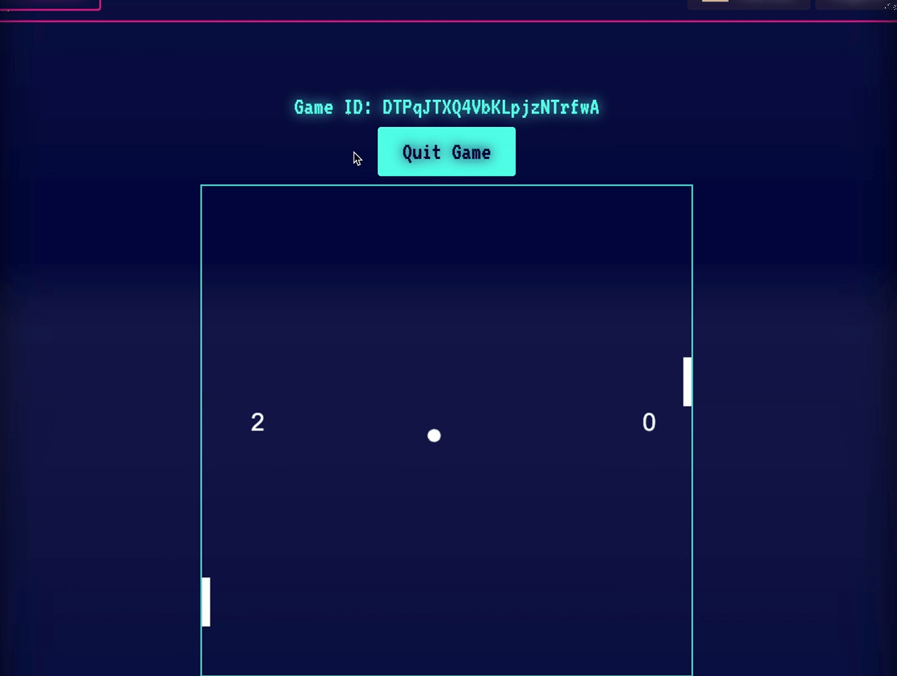

# TranscenDANCE

TranscenDANCE is a full-stack multiplayer Pong web application built as a three-person school project. The goal was to turn a simple arcade game into an internet-playable platform with accounts, real-time gameplay, live chat, friend management, tournaments, OAuth login, persistent statistics, and Dockerized deployment.

This project was completed over four months, from October 2024 to January 2025. It received a final grade of 118/100, including bonus work.



## Project Summary

The base challenge was to create a multiplayer Pong game playable over the internet. In practice, this required building much more than the game screen:

- A Django backend with a custom user model
- A JavaScript single-page frontend
- Real-time Pong using WebSockets
- Local and online multiplayer game modes
- Two-, three-, and four-player match support
- Four-player tournament lobbies and bracket progression
- Live chat with public, private, and group conversations
- Friend requests, friend lists, blocking, and user search
- Match history and game statistics
- Google OAuth and custom 42 OAuth login
- PostgreSQL persistence
- Redis-backed WebSocket/channel state and game-state caching
- Nginx reverse proxy with HTTPS and WebSocket forwarding
- A separate terminal-based Pong client that connects to the same backend

For someone outside the 42 school system: this is best understood as a capstone-style full-stack project. The assignment starts with Pong, but the real difficulty is integrating many web application systems that must work together in real time.

## What Makes This Project Challenging

The difficult parts were not only drawing a ball and paddles. The challenging student-level work was in the system integration:

**Real-time multiplayer synchronization**

The game loop runs on the backend and broadcasts state to connected clients through Django Channels WebSockets. Player input travels from the browser to the backend, updates Redis-cached game state, and is then sent back to all players. This avoids each browser running its own separate version of the game.

**Shared state across HTTP, WebSockets, Redis, and PostgreSQL**

The app uses PostgreSQL for durable data such as users, matches, scores, chat messages, friends, and tournaments. Redis is used for real-time channel layers and cached active game state. Keeping those two responsibilities separate is a common production-style architecture problem.

**Multiple multiplayer modes**

The Pong logic supports standard two-player games and expanded three- and four-player modes. In the larger modes, paddles can exist on more than two sides of the board, scoring changes, and the game state has to track up to four players at once.

**Tournament orchestration**

The tournament system coordinates four users through a lobby, creates two first-round game sessions, records round winners, creates a final match, and broadcasts progress to the lobby in real time. This is harder than a normal match because the app must coordinate several users across several game sessions.

**Authentication and social features**

The project includes a custom Django user model, normal registration/login, OAuth login, profile editing, profile images, friend requests, blocking, and match statistics. These features turn the game into a small social platform rather than a single isolated game page.

**Live chat integrated with gameplay**

Chat is implemented with WebSockets and persisted messages. Users can open private conversations, see message history, track online counts, and invite another user into a game from the chat interface.

**Deployment-style Docker setup**

The app runs as multiple services: Django, PostgreSQL, Redis, and Nginx. Nginx terminates HTTPS and proxies both normal HTTP traffic and WebSocket traffic to the Django app.

**Bonus terminal client**

The `CLI_play` directory contains a separate command-line Pong client. It logs into the Django backend, creates or joins a game, connects over WebSockets, and renders the game in the terminal. This proves the backend game API is not tied only to the browser UI.

## Tech Stack

- **Backend:** Django, Django REST Framework, Django Channels, Daphne/ASGI
- **Frontend:** Vanilla JavaScript single-page app, HTML, CSS, Canvas
- **Database:** PostgreSQL
- **Real-time layer:** Redis, channels-redis, WebSockets
- **Authentication:** Django auth, custom user model, django-allauth, Google OAuth, custom 42 OAuth provider
- **Proxy/deployment:** Docker Compose, Nginx, HTTPS self-signed certificate setup
- **CLI client:** Python, curses-style terminal rendering, requests, websockets

## Repository Structure

```text
.
├── _main_project/              # Django project and all Django apps
│   ├── _main_project/          # Settings, URLs, ASGI config, middleware
│   ├── a_user/                 # Custom user model, profiles, stats, blocking
│   ├── a_game/                 # Pong sessions, game loop, game API, WebSockets
│   ├── a_tournament/           # Tournament models, views, WebSocket lobby logic
│   ├── a_chat/                 # Chatrooms, messages, chat WebSocket consumer
│   ├── a_friends/              # Friend lists and friend requests
│   ├── a_oauth2/               # Custom 42 OAuth provider
│   ├── a_pass/                 # Password-related views
│   ├── a_spa_frontend/         # Single-page app entry views
│   ├── static/                 # JavaScript, CSS, images, frontend assets
│   └── templates/              # Django templates
├── CLI_play/                   # Terminal Pong client
├── nginx/                      # Nginx reverse proxy and HTTPS config
├── docker-compose.yml          # Web, database, Redis, and Nginx services
├── Dockerfile                  # Django application image
├── entrypoint.sh               # Migration, setup, and server startup script
├── Makefile                    # Convenience commands for Docker workflow
└── requirements.txt            # Python dependencies
```

## Main Features

### Pong Gameplay

Players can create and join game sessions through the web UI. The backend creates a `GameSession`, initializes a `GameState`, stores active game state in Redis, and broadcasts updates over `/ws/pong/<game_id>/`.

Supported game modes include:

- Local match
- Online two-player match
- Online three-player match
- Online four-player match
- Chat-created two-player match invitations
- Tournament matches

The browser version renders the game with an HTML canvas. Players can use keyboard controls or on-screen buttons.

### Tournaments

The tournament system creates a lobby with a shareable tournament ID. When four players join, the app assigns players into two first-round matches. Winners advance into a final match, and the lobby receives real-time updates through a tournament WebSocket.

### User Accounts

Users can register, log in, edit profiles, upload profile images, search other users, view match history, and track win/loss stats. The backend uses a custom `Account` model instead of Django's default user model.

### Friends and Blocking

The app supports friend requests, accepting/declining/canceling requests, removing friends, and blocking users. Blocking affects social interactions such as private messaging and friend requests.

### Live Chat

Chat supports public, private, and group chatrooms. Messages are stored in the database, while real-time delivery happens through WebSockets. The frontend chat widget can also start a Pong invitation from a private chat.

### OAuth Login

The project includes third-party authentication with Google and a custom OAuth provider for 42's API. The custom provider lives in `a_oauth2`.

### CLI Pong Client

`CLI_play/cli_pong.py` is a separate client that can authenticate with the web app, create or join a game, connect to the Pong WebSocket, and render live game state in the terminal.

## How The System Works

At a high level:

1. A user logs in through the SPA frontend.
2. The frontend requests a new game session from the Django REST endpoint.
3. Django creates a `GameSession` in PostgreSQL.
4. A `GameState` object is cached in Redis for fast real-time updates.
5. Each player connects to the game WebSocket.
6. When all expected players are ready, the backend starts the game loop.
7. Player input is sent to Django over HTTP endpoints.
8. The game loop updates the ball, paddles, scores, and winner state.
9. Updated state is broadcast to all connected players over WebSockets.
10. When the match ends, final scores and user stats are persisted to PostgreSQL.

## Running The Project

The project is intended to run through Docker Compose.

### 1. Create `.env`

Create a `.env` file in the repository root:

```env
PYTHONUNBUFFERED=1
PYTHONDONTWRITEBYTECODE=1

DEBUG=True
SECRET_KEY='change-me'
ALLOWED_HOSTS=*

DJANGO_SUPERUSER_EMAIL=admin@gmail.com
DJANGO_SUPERUSER_USERNAME=admin
DJANGO_SUPERUSER_PASSWORD=change-me

GOOGLE_CLIENT_ID='your-google-client-id'
GOOGLE_SECRET='your-google-secret'

42_CLIENT_ID='your-42-client-id'
42_SECRET='your-42-secret'

DATABASE_URL=postgres://postgres:postgres@db:5432/postgres
POSTGRES_USER=postgres
POSTGRES_PASSWORD=postgres
POSTGRES_DB=postgres
```

OAuth credentials are only required if you want Google or 42 login to work. Normal local accounts can be used for development.

### 2. Start The App

```bash
make up
```

The app is served through Nginx at:

```text
https://localhost:8000
```

Because the local setup uses a self-signed certificate, the browser may show a certificate warning.

### 3. Useful Make Commands

```bash
make build          # Build Docker images
make up             # Build and start the full app
make down           # Stop and remove containers
make logs           # Follow Docker logs
make re             # Clean, rebuild, and restart
make enter-web-app  # Open a shell in the Django container
```

Note: `make clean` and `make re` remove containers, images, volumes, and generated migration files. Use them only when you are comfortable resetting local state.

## Trying The Main User Flows

1. Open `https://localhost:8000`.
2. Register or log in.
3. Click `Start`.
4. Choose `Local Match`, `Online Multiplayer`, or `Tournament`.
5. For online multiplayer, create a match and share the generated game ID with another logged-in user.
6. For tournaments, create a lobby and share the tournament ID until four players join.
7. Open a user's profile or chat to test private messaging and game invitations.

## Running The CLI Client

The terminal client is in `CLI_play`.

```bash
cd CLI_play
pip install -r requirements_cli.txt
python cli_pong.py
```

The CLI client expects its own environment configuration for credentials, host, and game mode. See `CLI_play/README.md` for the full setup.

## Notable Implementation Details

- `a_game/game_logic.py` contains the core Pong state update logic.
- `a_game/consumers.py` runs the WebSocket game loop and broadcasts state.
- `a_game/views.py` exposes game creation, joining, movement, quitting, and ending APIs.
- `a_tournament/consumers.py` coordinates tournament lobby updates and round progression.
- `a_chat/consumers.py` handles real-time chat messages and online counts.
- `_main_project/asgi.py` combines chat, game, and tournament WebSocket routes.
- `nginx/nginx.conf` includes specific WebSocket proxy settings under `/ws/`.
- `entrypoint.sh` applies migrations, creates a superuser, creates social apps, creates the public chatroom, reloads active game state, and starts Django.

## Project Metadata

- **Project type:** Full-stack multiplayer web application
- **Context:** School project
- **Team size:** 3
- **Timeline:** October 2024 to January 2025
- **Duration:** Approximately 4 months
- **Final grade:** 118/100
- **Bonus work:** Some bonus modules completed, including expanded real-time/social functionality and a CLI game client

